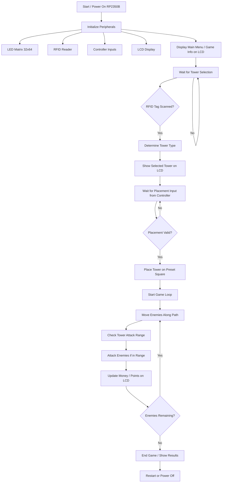
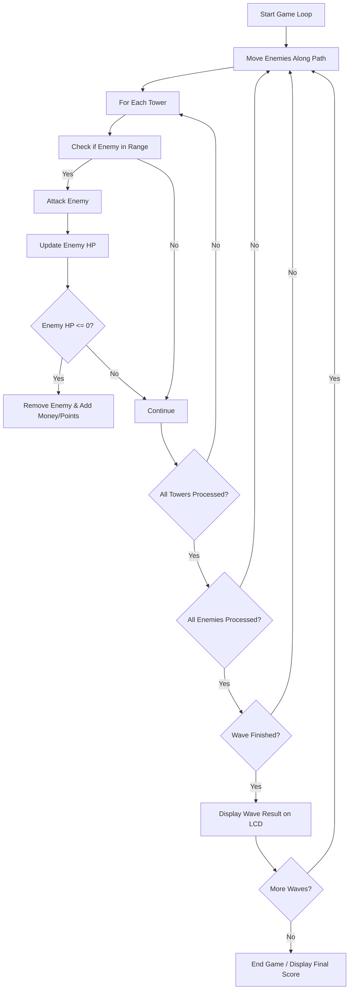

# RP2350B Tower Defense Game

A small-scale tower defense game implemented on the RP2350B microcontroller with LED matrix display and RFID-based tower selection.

---

## Project Overview
- **Microcontroller:** RP2350B  
- **Main Display:** 32x64 LED matrix  
- **Inputs:**  
  - RFID tags for tower selection  
  - Controller (buttons/joystick) for tower placement  
- **Secondary Display:** Small LCD for money/score display  
- **Game Mechanics:**  
  - Single-path map for enemies  
  - Three tower types  
  - Two enemy types  
  - Points/money displayed on LCD

---

## Peripherals & Wiring
1. **LED Matrix 32x64**  
   - Displays game map, towers, and enemies  
   - Use SPI/I2C for communication  

2. **RFID Reader**  
   - Reads tower selection tags  
   - Trigger tower selection logic  

3. **Controller**  
   - Input for tower placement  
   - Buttons or joystick for selecting placement square  

4. **LCD Display**  
   - Shows current money/points  
   - Updates on tower purchase or enemy defeat  

---

## Gameplay Flow (High Level)

---

## Tower Placement & Attack Loop (Detailed)

---

## Coding Notes
- Use **preset tower placement squares** to simplify collision/placement logic  
- Keep **enemy types minimal** for initial implementation  
- Modularize code by peripheral:  
  - `led_matrix.c/h` → Drawing map and towers  
  - `rfid.c/h` → Tower selection logic  
  - `controller.c/h` → Tower placement input  
  - `lcd.c/h` → Money/points display  
  - `game.c/h` → Game logic, enemy movement, tower attacks  

---

## Future Enhancements
- Add more tower/enemy types  
- Multiple paths or map designs  
- Upgrade animations on LED matrix  
- Add sound effects using buzzer  
